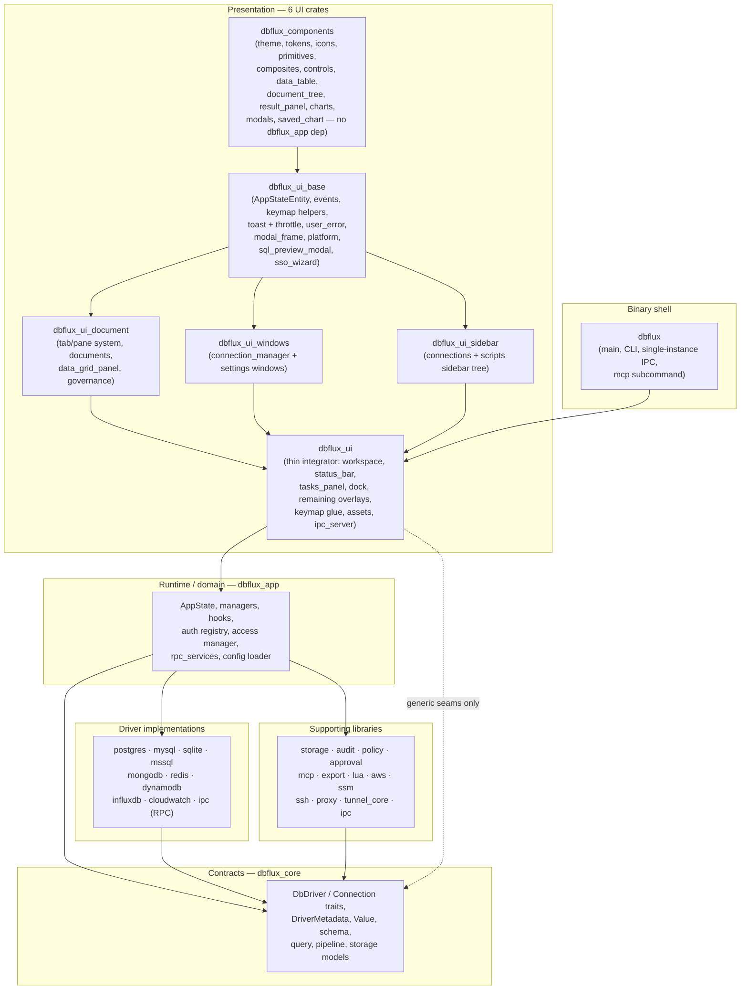
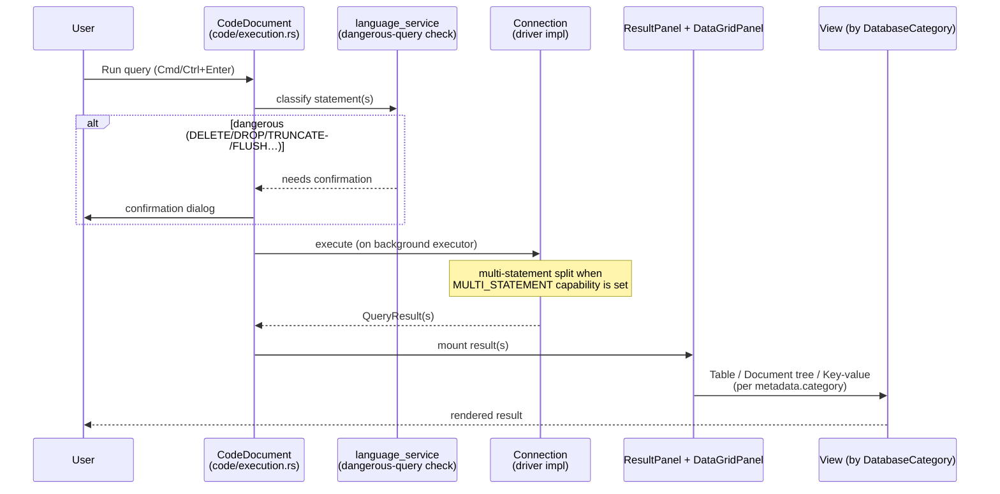
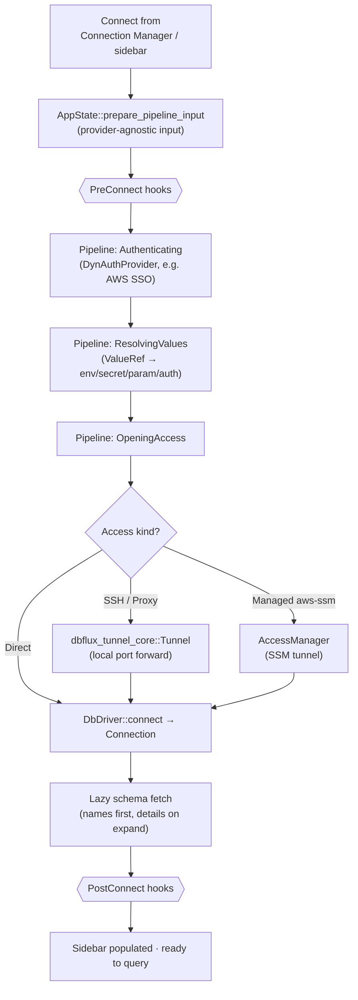

# Architecture

## Overview

- DBFlux is a keyboard-first database client built with Rust and GPUI, focused on fast workflows and a clean desktop UI (README.md).
- The repo is a Rust workspace with a UI app crate plus shared core types, driver implementations, and supporting libraries (Cargo.toml, crates/).
- Supports multiple database paradigms: relational (SQL), document (MongoDB, DynamoDB), key-value (Redis), time-series (InfluxDB), log-stream (CloudWatch Logs), graph, and wide-column stores.
- This is the canonical top-level document for project structure, architecture overview, crate boundaries, key files, and the cross-crate map. Other top-level docs should link here instead of duplicating that material.

## Architecture at a Glance

The text below is exhaustive but dense; these three diagrams give the mental model first. They are conceptual — exact symbol names live in the sections that follow.

### Layered crate map

Dependencies point downward. `dbflux_core` is the dependency-free contract layer every other crate builds on; the UI never depends on a concrete driver crate (see [Driver/UI decoupling](#driver-system)).



### Query flow

A query travels from the editor document to a driver `Connection` and back to a result view chosen by `DatabaseCategory` — the UI never branches on a driver id.



### Connection flow

Connecting runs a provider-agnostic pre-connect pipeline before the driver opens, with optional tunneling/managed access and lifecycle hooks at each phase.



## Tech Stack

- Language: Rust 2024 edition (crates/dbflux/Cargo.toml).
- UI: `gpui`, `gpui-component` (Cargo.toml).
- Databases: `tokio-postgres` (PostgreSQL), `rusqlite` (SQLite), `mysql` (MySQL/MariaDB), `mongodb` (MongoDB), `redis` (Redis), `aws-sdk-dynamodb` (DynamoDB) (Cargo.toml).
- AWS auth/integration: `aws-config`, `aws-sdk-sso`, `aws-sdk-ssooidc`, `aws-sdk-sts`, `aws-sdk-secretsmanager`, `aws-sdk-ssm` (`dbflux_aws`).
- IPC/RPC: `interprocess` local sockets + `bincode` message framing (`dbflux_ipc`, `dbflux_driver_ipc`, `dbflux_driver_host`).
- SSH: `ssh2` via `dbflux_ssh` (crates/dbflux_ssh/src/lib.rs).
- Export: `csv` + `hex` + `base64` + `serde_json` via `dbflux_export` (crates/dbflux_export/src/lib.rs).
- Serialization/config: `serde`, `serde_json`, `dirs` (Cargo.toml).
- Logging: `log`, `env_logger` (crates/dbflux/src/main.rs).

## Directory Structure

```
crates/
  dbflux/                   # Binary shell: main entry point, CLI, single-instance IPC
    src/
      main.rs               # Application entry point, logging, window bootstrap, IPC socket
      cli.rs                # CLI arg parsing, single-instance IPC client
  dbflux_components/        # Domain-free leaf: theme, tokens, icons, primitives, composites,
    src/                    # controls, typography, data_table, document_tree, tree_nav,
      theme.rs              # Theme definitions
      tokens.rs             # Design tokens (spacing, sizing constants)
      icons/                # SVG icon system (AppIcon enum)
        mod.rs
      icon.rs               # Icon rendering helpers
      primitives/           # Low-level building blocks (badge, banner, label, button, etc.)
      controls/             # Input controls (button, checkbox, dropdown, input, select, etc.)
      composites/           # Composed patterns (modal_frame, tab_strip, section_header, etc.)
      components/           # Domain components
        data_table/         # Custom virtualized data table
          mod.rs
          table.rs          # Main table component with phantom scroller
          state.rs          # Table state management
          model.rs          # CellValue and data model
          selection.rs      # Selection handling
          events.rs         # Event handling
          clipboard.rs      # Copy/paste support
          theme.rs          # Table styling
        document_tree/      # Hierarchical document/JSON viewer
          mod.rs
          state.rs          # Tree state with cursor, expansion, search
          tree.rs           # Tree rendering with keyboard navigation
          node.rs           # Node types (document, field, array item)
          events.rs         # Document tree events (selection, context menu)
        tree_nav/           # Reusable tree navigation component
          mod.rs
          gutter.rs
        filter_bar.rs       # Generic filter bar component
        form_navigation.rs  # FormNavigation / FormEditState traits
        form_renderer.rs    # Generic form field rendering
        json_editor_view.rs # Inline JSON editor component
        multi_select.rs     # Multi-select dropdown component
        value_source_selector.rs # Value source dropdown (Env/Secret/Parameter/Auth)
      modals/               # Reusable modal components (cell_editor, document_preview, etc.)
      result_panel/         # ResultPanel + ViewHandle universal chrome host
      chart/                # Chart engine (detect, spec, decimate, axis, legend, engine)
      saved_chart.rs        # SavedChart + SavedChartStore type alias
      common/               # Shared helpers (time_range picker, etc.)
      actions.rs            # Shared action definitions
      typography.rs
  dbflux_ui_base/           # AppStateEntity + events, keymap helpers, platform utilities
    src/
      app_state_entity.rs   # AppStateEntity wrapper (Deref + EventEmitter), AppStateGlobal,
                            # UserErrorReported + OpenAuditRequested events, unread_error_count
      keymap.rs             # default_keymap, key_chord_from_gpui
      async_ext.rs          # AsyncUpdateResultExt
      toast.rs              # Toast + ToastHost with severity-aware token-bucket throttle
      user_error/           # Centralized user-facing error reporting (UserFacingError,
                            # ErrorKind, report_error, report_error_async) + throttle
      modal_frame.rs        # Reusable modal chrome/frame
      platform.rs           # X11/Wayland detection, window options
      sql_preview_modal.rs  # SQL/query preview modal (dual-mode: SQL and generic)
      sso_wizard.rs         # SSO account/role discovery wizard [cfg aws]
  dbflux_ui_document/       # Tab/pane system, all document types, data_grid_panel, governance
    src/
      pane.rs               # PaneHandle: closure-erasing shell for typed Entity<T> documents
      tab_manager.rs        # Tab enum, TabManager (Vec<Tab> + MRU order), TabManagerEvent
      tab_bar.rs            # Visual tab bar rendering
      handle.rs             # DocumentEvent enum (unified — replaces per-document event enums)
      dedup.rs              # DocumentKey enum: identity key for tab deduplication
      types.rs              # DocumentId, DocumentKind, DocumentMetaSnapshot, DocumentState
      result_view.rs        # ResultViewMode enum (Table, LiveOutput, etc.)
      task_runner.rs        # Background task tracking for documents
      data_view.rs          # DataViewMode abstraction (Table vs Document)
      data_view_trait.rs    # DataView trait (available_view_modes, focus_handle, active_context)
      chrome.rs             # Shared chrome utilities
      governance.rs         # MCP approvals view for pending executions
      history_modal.rs      # Recent/saved queries modal
      add_member_modal.rs   # Modal for adding Redis set/list/sorted-set members
      new_key_modal.rs      # Modal for creating new Redis keys
      chart_document/       # ChartDocument: saved/interactive chart tab
        mod.rs              # ChartDocument entity
        pane.rs             # ChartDocument::into_pane constructor
        render.rs           # impl Render for ChartDocument
      data_document/        # DataDocument: standalone data browsing tab
        mod.rs              # DataDocument entity (thin shell around DataGridPanel + ResultPanel)
        pane.rs             # DataDocument::into_pane constructor
      data_grid_panel/      # Data grid with table/document view modes
        mod.rs
        context_menu.rs
        filter_bar.rs
        mutation_confirm.rs
        mutation_executor.rs
        mutations.rs
        navigation.rs
        query.rs
        render.rs
        row_inspector.rs
        utils.rs
      code/                 # CodeDocument: query/script editor
        mod.rs
        pane.rs             # CodeDocument::into_pane constructor
        completion.rs       # Language-aware autocompletion
        context_bar.rs      # Execution context dropdowns (connection/database/schema)
        diagnostics.rs      # Live query diagnostics
        execution.rs        # Query and script execution flow (incl. dangerous-query confirmation)
        file_ops.rs         # Auto-save, scratch/shadow file management
        focus.rs            # Internal focus management
        live_output.rs      # Document-owned streamed script output buffer
        render.rs           # Toolbar, editor, and live output rendering
      key_value/            # Redis/key-value-specific document tab
        mod.rs              # KeyValueDocument entity
        pane.rs             # KeyValueDocument::into_pane constructor
        view.rs             # KeyValueView boundary struct (file-level render helpers)
        commands.rs
        context_menu.rs
        copy_command.rs
        document_view.rs
        mutations.rs
        pagination.rs
        parsing.rs
        render.rs           # impl Render for KeyValueDocument
      audit/                # AuditDocument: unified event/audit viewer tab
        mod.rs              # AuditDocument entity
        pane.rs             # AuditDocument::into_pane constructor
        view.rs             # LogStreamView boundary struct
        render.rs           # Extracted render code (~1300 LOC)
        commands.rs         # Extracted command dispatch (~560 LOC)
        filters.rs
        saved_filter.rs
        source_adapter.rs
      chart/                # ChartShell host for metric/instance charts (distinct from chart_document/)
        mod.rs
        shell.rs            # ChartShell host entity
        host.rs
        metric_picker.rs
        metric_picker_render.rs
        toolbar.rs
      instance_inspector/   # InstanceInspectorDocument (backs DocumentKey::InstanceInspector)
        mod.rs
        pane.rs             # into_pane constructor
  dbflux_ui_sidebar/        # Connections + scripts sidebar tree with folders, drag-drop
    src/
      lib.rs                # SidebarView entity (re-exported by dbflux_ui)
      code_generation.rs
      context_menu.rs
      deletion.rs
      drag_drop.rs
      expansion.rs
      operations.rs
      render.rs
      render_footer.rs
      render_overlays.rs
      render_tree.rs
      selection.rs
      table_loading.rs
      tree_builder.rs
  dbflux_ui_windows/        # Settings window + connection manager window
    src/
      ssh_shared.rs         # Shared SSH auth UI components
      settings/             # Settings window sections
        mod.rs
        render.rs           # Top-level settings window rendering
        lifecycle.rs        # Settings window open/close/save logic
        sidebar_nav.rs      # Settings sidebar navigation (TreeNav)
        dirty_state.rs      # Unsaved-changes tracking for settings forms
        form_nav.rs         # FormGridNav<F> generic 2D grid navigation
        form_section.rs     # FormSection trait for keyboard navigation
        section_trait.rs    # SettingsSection trait
        general.rs          # General settings (theme, safety toggles)
        keybindings.rs      # Keybindings settings section
        auth_profiles_section.rs # Dynamic auth profile CRUD by provider form definition
        proxies.rs          # Proxy CRUD form with FormGridNav
        ssh_tunnels.rs      # SSH tunnel CRUD form with FormGridNav
        hooks.rs            # Hook definitions CRUD
        drivers.rs          # Per-driver settings overrides
        rpc_services.rs     # RPC services settings UI (Driver/Auth Provider descriptors)
        audit_section.rs    # Audit settings section
        about_section.rs    # About section
        mcp_section.rs      # MCP settings (trusted clients, roles, policies, audit; feature-gated)
      connection_manager/   # Connection manager window
        mod.rs
        access_tab.rs       # Unified access mode editor (Direct/SSH/Proxy/SSM)
        form.rs             # Connection form state and field management
        navigation.rs       # Keyboard navigation within connection manager
        render.rs           # Top-level connection manager rendering
        render_driver_select.rs
        render_tabs.rs
        hooks_tab.rs        # Per-profile hook bindings
  dbflux_ui/                # Thin integrator (~13.5k LOC): wires the six UI crates together
    src/                    # Re-exports moved subsystems via pub use shims at old module paths
      lib.rs                # Crate root; re-exports via shim modules
      app.rs                # GPUI app bootstrap
      ipc_server.rs         # App-control IPC server (Focus, OpenScript)
      assets.rs             # GPUI AssetSource impl for embedded SVG icons
      platform.rs           # Shim: pub use dbflux_ui_base::platform::*
      keymap/               # Keyboard glue (actions, dispatcher)
        mod.rs
        actions.rs
        dispatcher.rs
      ui/
        views/
          workspace/        # Main layout, command dispatch, focus routing
            mod.rs
            actions.rs      # Workspace-level action handlers
            dispatch.rs     # Command dispatch logic
            render.rs       # Workspace rendering
          status_bar.rs     # Status bar rendering
          tasks_panel.rs    # Background tasks panel
        dock/
          sidebar_dock.rs   # Collapsible, resizable sidebar
        overlays/           # Remaining overlays that stay in dbflux_ui
          command_palette.rs       # Fuzzy command palette
          login_modal.rs           # SSO login waiting modal with timeout
          shutdown_overlay.rs      # Graceful shutdown overlay
          # Shims at old overlay paths re-export from dbflux_ui_base / dbflux_components:
          sql_preview_modal.rs     # → dbflux_ui_base::sql_preview_modal
          sso_wizard.rs            # → dbflux_ui_base::sso_wizard
          cell_editor_modal.rs     # → dbflux_components::modals::cell_editor
          document_preview_modal.rs # → dbflux_components::modals::document_preview
        document.rs         # Shim: pub use dbflux_ui_document::*
        icons/mod.rs        # Shim: re-exports AppIcon + embedded_bytes (SVG resources live here)
        theme.rs            # Shim: pub use dbflux_components::theme::*
        tokens.rs           # Shim: pub use dbflux_components::tokens::*
        components/
          modal_frame.rs    # Shim: → dbflux_ui_base::modal_frame
          toast.rs          # Shim: → dbflux_ui_base::toast
        windows/mod.rs      # Shim: pub use dbflux_ui_windows::*
        views/sidebar/mod.rs # Shim: pub use dbflux_ui_sidebar::*
  dbflux_app/               # Runtime/domain: AppState (plain struct), managers, hooks, auth
    src/
      app_state.rs          # AppState (plain struct, no GPUI dependency)
      access_manager.rs      # AppAccessManager for direct/managed access
      auth_provider_registry.rs # Runtime auth provider registry
      hook_executor.rs       # Composite hook executor routing
      proxy.rs               # create_proxy_tunnel callback for CreateTunnelFn
      config_loader.rs       # SQLite-backed configuration persistence
      rpc_services/          # RPC service discovery/adaptation seam for runtime bootstrap (external_audit, ...)
      history_manager_sqlite.rs # SQLite-backed query history
      mcp_command.rs         # MCP subcommand integration and arg parsing
      keymap/                # Keyboard system (pure domain types)
        mod.rs               # Re-exports Command/ContextId from dbflux_core::keymap_types
        focus.rs             # FocusTarget enum (pure domain)
  dbflux_core/              # Traits, core types, storage, errors
    src/access/             # AccessKind, AccessManager, and managed-access serialization
      mod.rs
    src/auth/               # AuthProfile + DynAuthProvider contracts
      mod.rs
      types.rs
    src/core/               # Fundamental types and traits
      traits.rs             # DbDriver + Connection traits
      error.rs              # DbError type
      error_formatter.rs    # ErrorFormatter trait for driver-specific error messages
      value.rs              # Generic Value type for cross-database data
      shutdown.rs           # ShutdownCoordinator
      task.rs               # Background task tracking
    src/driver/             # Driver metadata and form definitions
      capabilities.rs       # DatabaseCategory, QueryLanguage, DriverCapabilities, DriverMetadata
      form.rs               # Dynamic form definitions per driver
    src/schema/             # Database schema types
      types.rs              # Schema types (tables, collections, indexes, FKs)
      builder.rs            # Builder helpers for schema construction
      node_id.rs            # SchemaNodeId for tree identification
    src/sql/                # SQL generation and dialects
      dialect.rs            # SqlDialect trait for SQL flavor differences
      generation.rs         # SQL INSERT/UPDATE/DELETE generation
      query_builder.rs      # SqlQueryBuilder for safe query construction
      code_generation.rs    # DDL code generation (indexes, types, FKs)
    src/query/              # Query types and language services
      types.rs              # QueryRequest, QueryResult, Row, ColumnMeta
      generator.rs          # QueryGenerator trait, mutation/read templates, semantic preview helpers
      language_service.rs   # Dangerous query detection (SQL, MongoDB, Redis)
      safety.rs             # Safe read query detection
      table_browser.rs      # Table browsing state and pagination
    src/connection/         # Connection management and profiles
      profile.rs            # Connection/SSH profiles
      profile_manager.rs    # ProfileManager
      manager.rs            # ConnectionManager, schema caching, connect flow
      hook.rs               # Hook definitions, HookRunner, phase orchestration
      tree.rs               # Folder/connection tree model
      tree_manager.rs       # ConnectionTreeManager
      context.rs            # Per-tab execution context (connection/database/schema)
      proxy.rs              # ProxyProfile, ProxyKind, ProxyAuth, no_proxy matching
      proxy_manager.rs      # ProxyManager (type alias for ItemManager<ProxyProfile>)
      ssh_tunnel_manager.rs # SshTunnelManager
      item_manager.rs       # Generic ItemManager<T>, Identifiable, DefaultFilename traits
    src/storage/            # Persistence and state
      session.rs            # Session persistence (scratch/shadow files, manifest)
      history.rs            # History persistence
      saved_query.rs        # Saved queries persistence
      recent_files.rs       # Recent files tracking
      secrets.rs            # Keyring secret storage
      secret_manager.rs     # SecretManager with HasSecretRef trait
      ui_state.rs           # UiStateStore for persisted UI state (sidebar collapse)
    src/data/               # Data types and operations
      crud.rs               # CRUD mutation types for all database paradigms
      key_value.rs          # Key-value operation types (Hash, Set, List, ZSet, Stream)
      view.rs               # DataViewMode (Table/Document) abstraction
    src/config/             # Application configuration
      app.rs                # Legacy config.json import (deprecated)
      refresh_policy.rs     # Schema refresh policy
      scripts_directory.rs  # Scripts folder tree (file/folder CRUD)
    src/pipeline/           # Pre-connect pipeline (auth/value/access stages)
      mod.rs
      resolve.rs
    src/values/             # ValueRef resolution + provider registry + cache
      resolver.rs
    src/facade/             # Session facade
      session.rs            # Session facade for connection management
  dbflux_ipc/               # Versioned IPC contracts and framing
    src/auth.rs             # IPC auth token generation and file storage
    src/envelope.rs         # ProtocolVersion + app/driver protocol constants
    src/protocol.rs         # Single-instance app-control messages
    src/driver_protocol.rs  # Driver RPC request/response schema (DTOs + errors)
    src/framing.rs          # Length-prefixed bincode transport framing
    src/socket.rs           # Cross-platform socket naming helpers
  dbflux_driver_ipc/        # DbDriver adapter for external RPC services
    src/driver.rs           # IpcDriver + managed host lifecycle
    src/transport.rs        # RPC client transport and handshake
    src/connection.rs       # Connection proxy over driver RPC
  dbflux_driver_host/       # Host process that serves drivers over RPC
    src/main.rs             # Driver RPC server entry point
    src/session.rs          # Session manager and method dispatch
  dbflux_driver_postgres/   # PostgreSQL driver implementation
  dbflux_driver_sqlite/     # SQLite driver implementation
  dbflux_driver_mysql/      # MySQL/MariaDB driver implementation
  dbflux_driver_mssql/      # Microsoft SQL Server driver implementation
  dbflux_driver_mongodb/    # MongoDB driver implementation
    src/driver.rs           # Connection, schema discovery, CRUD operations
    src/query_parser.rs     # MongoDB query syntax parser (db.collection.method())
    src/query_generator.rs  # MongoDB shell query generator (insertOne, updateOne, etc.)
  dbflux_driver_redis/      # Redis driver implementation
    src/driver.rs           # Connection, key-value API, schema discovery
    src/command_generator.rs # Redis command generator (SET, HSET, SADD, etc.)
  dbflux_driver_dynamodb/   # DynamoDB driver implementation
    src/driver.rs           # Connection, schema discovery, scan/query/put/update/delete
    src/query_parser.rs     # JSON command envelope parser for DynamoDB operations
    src/query_generator.rs  # Mutation -> DynamoDB command envelope generator
    tests/live_integration.rs # Docker-backed integration tests (DynamoDB Local)
  dbflux_driver_influxdb/   # InfluxDB driver (v1 + v2)
    src/driver.rs           # Connection, bucket/measurement discovery, query execution
    src/query_generator.rs  # InfluxQL (v1) and Flux (v2) query/template generation
  dbflux_driver_cloudwatch/ # AWS CloudWatch Logs driver (DatabaseCategory::LogStream)
    src/driver.rs           # Log group/stream discovery, EventStreamTarget, CollectionPresentation::EventStream
  dbflux_aws/               # AWS auth providers + Secrets Manager/SSM value providers
    src/auth.rs             # AWS SSO/shared/static providers and SSO login flow
    src/config.rs           # ~/.aws/config parser/cache and profile write-back helpers
    src/accounts.rs         # AWS SSO account and role discovery
  dbflux_ssm/               # AWS SSM tunnel factory for managed access
  dbflux_lua/               # Embedded Lua runtime for in-process hooks
    src/executor.rs         # Lua HookExecutor implementation
    src/engine.rs           # Lua VM creation and shared runtime state
    src/api/dbflux.rs       # dbflux.log/env/process Lua APIs
    src/api/connection.rs   # Lua connection.* API (exposes HookContext)
    src/api/hook.rs         # Lua hook.* API (phase, failure policy)
  dbflux_tunnel_core/       # Shared RAII tunnel infrastructure
    src/lib.rs              # Tunnel, TunnelConnector, ForwardingConnection<R>
  dbflux_proxy/             # SOCKS5/HTTP CONNECT proxy tunnel
    src/lib.rs              # ProxyTunnelConfig, SOCKS5/HTTP handshake, tunnel loop
  dbflux_ssh/               # SSH tunnel support
  dbflux_export/            # Export (CSV, JSON, Text, Binary)
    src/lib.rs              # Shape-based export API and format dispatch
    src/binary.rs           # Binary/hex/base64 exporter
    src/csv.rs              # CSV exporter
    src/json.rs             # JSON pretty/compact exporter
    src/text.rs             # Text table exporter
  dbflux_mcp/               # MCP runtime and governance
    src/lib.rs              # Exports for runtime, governance service, tool catalog
    src/runtime.rs          # McpRuntime implementing McpGovernanceService
    src/governance_service.rs # McpGovernanceService trait and DTOs
    src/tool_catalog.rs     # Canonical MCP tools and deferred tool definitions
    src/built_ins.rs        # Built-in roles and policies
     src/handlers/           # MCP tool handlers (query, approval, discovery, scripts)
    src/server/             # MCP server infrastructure (router, authorization, bootstrap)
  dbflux_mcp_server/        # Standalone MCP server binary
    src/main.rs             # CLI entrypoint with --client-id and --config-dir
    src/server.rs           # JSON-RPC request loop over stdin/stdout
    src/bootstrap.rs        # Runtime initialization and state
    src/transport.rs        # Line-based stdin/stdout transport
    src/connection_cache.rs # Connection pool for the standalone server
    src/handlers/           # Tool handlers adapted for standalone operation
  dbflux_policy/            # Policy engine and classification
    src/lib.rs              # Exports for engine, classification, trusted clients
    src/classification.rs   # ExecutionClassification enum (Metadata/Read/Write/Destructive/AdminSafe/Admin/AdminDestructive)
    src/engine.rs           # PolicyEngine with PolicyRole and ToolPolicy
    src/trusted_clients.rs  # TrustedClientRegistry for known AI clients
    src/assignments.rs      # ConnectionPolicyAssignment and PolicyBindingScope
  dbflux_approval/           # Approval service for deferred executions
    src/lib.rs              # Exports for ApprovalService and pending store
    src/service.rs          # ApprovalService (approve/reject lifecycle)
    src/store.rs            # InMemoryPendingExecutionStore and ExecutionPlan
  dbflux_audit/             # Audit logging
    src/lib.rs              # AuditService: validate, fingerprint, redact, record
    src/query.rs            # AuditQueryFilter (actor, category, action, outcome, date range)
    src/export.rs           # Audit export to JSON/CSV (basic and extended schemas)
    src/redaction.rs        # Sensitive value redaction for details_json and error_message
    src/purge.rs            # Retention-based event purge (batched deletes)
    src/store/sqlite.rs     # SqliteAuditStore delegating to AuditRepository
  dbflux_storage/            # Unified SQLite storage
    src/bootstrap.rs        # StorageRuntime with single dbflux.db connection
    src/paths.rs            # dbflux_db_path() returns ~/.local/share/dbflux/dbflux.db
    src/migrations/         # Trait-based migration system
      mod.rs                # MigrationRegistry, Migration trait
      *.rs                  # Individual migration files (001_initial.rs, etc.)
    src/repositories/       # All domain repositories
      traits.rs             # Repository trait (all(), find_by_id(), upsert(), delete())
      audit.rs              # AuditRepository with AuditEventDto
      *.rs                  # Other domain repositories
    src/legacy.rs           # JSON-to-SQLite import
  dbflux_test_support/       # Docker containers and fixtures for integration tests
    src/containers.rs       # Docker container lifecycle (Postgres, MySQL, MongoDB, Redis, DynamoDB Local)
    src/fixtures.rs         # Test fixture helpers
    src/fake_driver.rs      # FakeDriver for unit tests
```

## Core Components

### Application Layer

- App entry point: `crates/dbflux/src/main.rs` initializes logging, theme, and main GPUI window.
- Global app state: `crates/dbflux_app/src/app_state.rs` (plain struct, no GPUI dependency) holds drivers, profiles, active connections, history, task manager, and secret store access.
- CLI and single-instance: `crates/dbflux/src/cli.rs` parses arguments; `crates/dbflux_ui/src/ipc_server.rs` runs the app-control IPC server for `Focus` and `OpenScript` commands.
- Assets: `crates/dbflux_ui/src/assets.rs` implements GPUI's `AssetSource` to serve embedded SVG icons.
- Workspace UI shell: `crates/dbflux_ui/src/ui/views/workspace/` wires panes (sidebar/dock, document area, bottom dock), command palette, and focus routing. Split across `mod.rs`, `actions.rs`, `dispatch.rs`, and `render.rs`. This module stays in `dbflux_ui`.

### User-facing error reporting

User-triggered failures route through a single seam in `crates/dbflux_ui_base/src/user_error/mod.rs` so every actionable error produces a toast, an audit row, and a status-bar badge increment — all keyed by the same UUID v7 correlation id.

- **Entry points**: `report_error(UserFacingError, &mut App)` (foreground) and `report_error_async(UserFacingError, &AsyncApp)` (background / `cx.spawn` / `background_executor`). The sync variant must NOT be called from a background context — it requires `&mut App`.
- **Taxonomy**: `ErrorKind { Storage, Network, Auth, Hook, Driver, User, Config }` drives badge/toast styling and the audit `action` discriminator. Severity reuses `dbflux_core::observability::EventSeverity`; `report_error` does not add a parallel enum.
- **Driver feed**: `UserFacingError::from_formatted(kind, FormattedError)` consumes the existing driver `ErrorFormatter` output. UI code never branches on driver id.
- **Audit bridge**: the seam emits `tracing::error!(target = "dbflux_ui::user_error", correlation_id = %id, kind, action = "user_error", outcome = "failure", ...)`. `AuditFieldVisitor` (`crates/dbflux_core/src/observability/tracing_bridge/layer.rs`) routes both `record_str` and `record_debug` through `record_string_by_name` so the typed `EventRecord.correlation_id` slot is populated regardless of whether the field is recorded via the `%` (Display) or `?` (Debug) sigil.
- **Toast throttle**: `ToastHost` keeps a per-severity token bucket (capacity 5, refill 1 token / 2 s) for Info and Warn so connection-loss storms do not bury the screen. Error and Fatal bypass the throttle. The bucket's clock is injectable for deterministic tests.
- **Badge + navigation**: `AppStateEntity::note_user_error` increments `unread_error_count` and emits `UserErrorReported`. The status-bar badge subscribes and, on click, calls `AppStateEntity::request_open_audit(None, cx)` which emits `OpenAuditRequested`. The toast "View in Audit" action emits the same event with `Some(correlation_id)`. The workspace subscribes once to `OpenAuditRequested` and steers `AuditDocument` via `set_correlation_filter` or `new_with_correlation_id`.
- **Convention**: only the first catch site reports. Propagators above must NOT re-report — there is no runtime deduplication, double-toasts are a code-review concern (see AGENTS.md § Error Handling).

### Document System

`crates/dbflux_ui_document/src/` implements a tab-based document architecture with five layers:

**Layers (outermost to innermost)**

1. **`Tab`** (`tab_manager.rs`) — `#[non_exhaustive]` enum with a single `Pane(Box<PaneHandle>)` variant. Kept as enum for forward-compatibility (e.g., future detachable pane variants). `TabManager` holds a `Vec<Tab>` plus MRU ordering.

2. **`PaneHandle`** (`pane.rs`) — closure-erasing shell that replaces the old closed `DocumentHandle` enum. Each of the 22 operations (render, focus, dispatch_command, meta_snapshot, tab_title, can_close, connection_id, active_context, change_summary, refresh_policy, set_active_tab, set_refresh_policy, flush_auto_save, matches_dedup_key, subscribe, plus optional helpers) is a `Box<dyn Fn>` closure capturing the typed `Entity<T>`. `PaneHandle` is `!Clone`. Each document type provides `XxxDocument::into_pane(entity, cx) -> PaneHandle` in its own `pane.rs` file (all under `crates/dbflux_ui_document/src/`). Adding a new document type requires no changes to `workspace/mod.rs`, `tab_manager.rs`, `tab_bar.rs`, or `handle.rs`.

3. **`DocumentKey`** (`dedup.rs`) — identity enum used for tab deduplication. Variants: `Table`, `Collection`, `File`, `KeyValueDb`, `Chart`, `Audit`, `EventStream`, `Routine`, `MetricChart`, `Dashboard`, `InstanceMetric`, `InstanceInspector`, `InstanceOverview`. Replaces the `is_*` methods on the old `DocumentHandle`. Call sites use `tab_manager.find_by_key(&DocumentKey::Table { ... }, cx)`.

4. **`DocumentEvent`** (`handle.rs`, ~30 LOC) — unified event enum replacing four per-document event enums that were deleted. Variants: `MetaChanged`, `ExecutionStarted`, `ExecutionFinished`, `RequestClose`, `RequestFocus`, `RequestSqlPreview`, `OpenInspector`, `ChartThisQuery`.

5. **`ResultPanel` + `ViewHandle`** (`crates/dbflux_components/src/result_panel/mod.rs`) — universal chrome host. `ResultPanel` owns a chrome row and delegates body rendering to a `ViewHandle` (7 closures: render, focus, focus_handle, toolbar_segments, available_modes, current_mode, set_mode). The slot system (`ToolbarSegment { position: SegmentPosition::{Left,Center,Right}, index: u16, builder }`) lets views contribute arbitrary chrome: `ResultPanel` merges built-in segments (mode bar at Left/0 when `available_modes.len() >= 2`) and view-provided segments, sorts by `(position, index)`, and renders them in a `flex_wrap` row.

**The document types**

- `DataDocument` (`crates/dbflux_ui_document/src/data_document/`) — thin shell around `DataGridPanel` + `ResultPanel`. DataGridPanel mounts as a `ViewHandle`; a filter bar is injected as a Center/0 segment.
- `ChartDocument` (`crates/dbflux_ui_document/src/chart_document/`) — `ChartShell` entity + lazy `Option<Entity<ResultPanel>>`. Chart area, axis bar, and action buttons mount as Left/Center/Right segments. Renders standalone or embedded inside a `DashboardDocument` panel.
- `DashboardDocument` (`crates/dbflux_ui_document/src/dashboard/`) — named grid of chart panels with a shared `TimeRangePanel` and refresh policy. Each panel is either a `Loaded` `ChartDocument` entity or an `Orphan` placeholder for a deleted chart. Panel re-execution is bounded by `PANEL_REEXEC_CAP`. See `docs/DASHBOARDS.md`.
- `CodeDocument` (`crates/dbflux_ui_document/src/code/`) — multi-tab editor. Each result tab wraps its `DataGridPanel` in its own `ResultPanel`. Outer chrome (editor, context bar, tab strip) is self-rendered.
- `KeyValueDocument` (`crates/dbflux_ui_document/src/key_value/`) — self-renders. `KeyValueView` is a file-level boundary struct (not a separate GPUI entity) grouping render helpers extracted from `key_value/render.rs`.
- `AuditDocument` (`crates/dbflux_ui_document/src/audit/`) — self-renders. `LogStreamView` is a file-level boundary struct. Body extracted to `audit/render.rs` and `audit/commands.rs` as sibling `impl AuditDocument` files.
- `InstanceInspectorDocument` (`crates/dbflux_ui_document/src/instance_inspector/`) — tabular instance-inspector snapshot tab, keyed by `DocumentKey::InstanceInspector`.
- `chart/` (`crates/dbflux_ui_document/src/chart/`) — the `ChartShell` host (`shell.rs`, `host.rs`) plus metric picker (`metric_picker*.rs`) and `toolbar.rs`, distinct from `chart_document/`; it backs metric/instance charts.

**Adding a new document type** (no changes required outside the new module):
1. Create `crates/dbflux_ui_document/src/<name>/mod.rs` with the entity.
2. Create `crates/dbflux_ui_document/src/<name>/pane.rs` with `into_pane(entity, cx) -> PaneHandle`.
3. Add a `DocumentKey` variant in `crates/dbflux_ui_document/src/dedup.rs` if dedup is needed.
4. Add an `open_<name>` function in `crates/dbflux_ui/src/ui/views/workspace/actions.rs`.

**Architectural notes**

- `KeyValueView` and `LogStreamView` are file-level boundary structs, not separate GPUI entities. GPUI's single-`Context<T>` borrow model makes cross-entity `impl Render` splits infeasible when 40+ `cx.listener()` closures in a document close over `Self`; splitting would require relocating all domain state to the view entity. The achieved boundary is file-level.
- `DataView` trait (`data_view_trait.rs`) does not include a `render` method. The spec called for `render` on the trait, but `impl IntoElement` is not trait-object-safe and boxing to `AnyElement` conflicts with GPUI idioms. Rendering goes through `ViewHandle.render` instead.
- Auto-save: tabs auto-save to scratch files (untitled) or shadow files (file-backed) on a 2-second debounce. Ctrl+S writes to the original file. Tabs close without warnings.
- Session restore: `SessionStore` persists a manifest of open tabs to `~/.local/share/dbflux/sessions/`. On startup, all tabs are restored with conflict detection for externally modified files. Only code documents produce `CodeSessionTabSnapshot`; other document types are not session-persisted.
- Duplicate prevention: `tab_manager.find_by_key` checks `PaneHandle::matches_dedup_key` before opening a new tab, focusing the existing one if found.

### Visual Query Builder

A right-rail builder composes SELECT/UPDATE/DELETE statements without writing SQL and feeds them into the DataView. It is driver-agnostic by construction: gated on `QueryLanguage::Sql`, with no per-driver branching anywhere in the path.

**Core spec types** (`crates/dbflux_core/src/query/visual_query.rs`, re-exported from `dbflux_core::query`):
- `VisualQuerySpec` — the SELECT model: projection, FROM with alias, JOINs, a recursive `WHERE` predicate tree (`FilterNode` / `Predicate`), GROUP BY / aggregates / HAVING, `ORDER BY` (`SortEntry`), and `LIMIT`/`OFFSET`.
- `VisualMutationSpec` (with `MutationKind`, `ColumnAssignment` / `Assignment`, `AssignmentValue`) — the UPDATE/DELETE model. A raw-expression assignment is tracked via a `used_raw_expression` flag rather than a textual marker.
- `EditableBinding` — proof that a SELECT result is *editable-safe* (see Inline edit below).

**SQL generation** (`crates/dbflux_core/src/query/generator.rs`): the `QueryGenerator` trait gains three defaulted methods — `generate_select`, `generate_update_from_spec`, `generate_delete_from_spec`. These delegate to the crate-internal `SqlSelectBuilder` (free functions `build_select_query` / `build_grouped_count_query`), which renders dialect-specific SQL for SQLite, PostgreSQL, MySQL/MariaDB, and SQL Server. Grouped queries reuse `build_group_by` / `build_having` / `build_count_of_grouped` so pagination runs a `COUNT(*)` subquery over the grouped SELECT. UPDATE/DELETE emit keyset-paginated chunked DML over the table PK.

**Mutation policy** (`crates/dbflux_core/src/connection/manager.rs`): `MutationPolicy { Allowed | ReadOnly | ApprovalRequired }` composes MCP-actor governance, per-profile read-only, and a default `Allowed` resolution. No-`WHERE` UPDATE/DELETE is additionally gated by a doubled spec-level + text-level `DangerousQueryKind` check.

**UI** (`crates/dbflux_ui_document/src/query_builder/`): `QueryBuilderPanel` (`panel.rs`, `view.rs`) renders the rail with a mode selector and per-clause sections under `sections/` (`columns`, `joins`, `filters`, `group_by`, `sort`, `assignments`, `execution`); `mutation_state.rs`, `completion.rs` (schema-aware autocomplete), `events.rs`, and `tree_ops.rs` support it. The SQL preview is always visible and regenerates synchronously on every change.

**Execution** (`crates/dbflux_ui_document/src/data_grid_panel/`): the builder integrates into the DataView; `MutationExecutor` (`mutation_executor.rs`) drives an `ExecutionMode` state machine — `SingleTransaction`, `ChunkedTransaction`, `DirectAutocommit` — auto-suggested from the count estimate, the `TRANSACTIONS` capability, and primary-key availability (with a tradeoff modal on user override). Chunked runs use keyset pagination (chunk size clamped to `[1000, 10000]`, default 5000), surface per-chunk Tasks-panel entries with cancellation between chunks, and `ROLLBACK` on chunk failure.

**Inline edit on builder results**: when a SELECT result is provably editable-safe — maps 1:1 to a single underlying table and projects every PK column under its original name — the builder computes an `EditableBinding` from the committed `VisualQuerySpec` and threads it into the DataView, reusing the single-table mutation path with a `WHERE` built from projected PK values (no SQL parsing). JOINs are allowed: source-table columns stay editable, joined columns are read-only. Aggregates / `GROUP BY` / `HAVING`, alias-projected or missing PKs, and not-yet-loaded schema keys fall back to read-only. The proof lives in `dbflux_core` over generic spec/metadata types, so every relational driver picks it up.

**Persistence**: migration `017_qry_saved_queries` adds the `qry_*` table family (root + columns/sorts/joins child tables, cascading FKs, `UNIQUE (profile_id, name)`), fronted by `SavedQueryRepo` (`crates/dbflux_storage/src/repositories/qry_saved_queries.rs`) and the in-memory `SavedQueryManager` (`crates/dbflux_ui_base/src/saved_query_manager.rs`). A `TableProbe` seam verifies table existence when importing a saved query onto another connection without reaching into driver code.

### Data Visualization

- **Data table**: `crates/dbflux_components/src/components/data_table/` custom virtualized table with sorting, selection, horizontal scrolling via phantom scroller pattern, keyboard navigation, column resizing, and context menu with CRUD operations.
- **Document tree**: `crates/dbflux_components/src/components/document_tree/` hierarchical JSON/BSON viewer for document databases with keyboard navigation (j/k/h/l), search (Ctrl+F or /), collapsible nodes, and view modes (Keys Only, Keys+Preview, Full Values).
- **Key-value view**: `crates/dbflux_ui_document/src/key_value/` Redis-specific document tab with per-type rendering (String, Hash, List, Set, SortedSet, Stream), pagination, mutations, and context menu. Integrates with the workspace via a `PaneHandle` constructed in `key_value/pane.rs`.
- Cell editor modal: `crates/dbflux_components/src/modals/cell_editor.rs` provides a modal editor for JSON columns and long/multiline text, with JSON validation and formatting. (Shim at the old overlay path in `dbflux_ui`.)
- Document preview modal: `crates/dbflux_components/src/modals/document_preview.rs` full-screen JSON document preview with an inline JSON editor. (Shim at the old overlay path in `dbflux_ui`.)
- Command palette: `crates/dbflux_ui/src/ui/overlays/command_palette.rs` fuzzy-search command palette for all app actions.

### Dashboards & Saved Charts

DBFlux persists chart configurations as **Saved Charts** and groups them into **Dashboards** (a grid of chart panels and optional markdown dividers, with a shared time range + refresh policy). Drivers opt into dashboard import/browse via generic core seams — the UI never branches on driver IDs.

- **Storage**: `viz_*` tables in `~/.local/share/dbflux/dbflux.db`. Repositories live in `crates/dbflux_storage/src/repositories/viz_dashboards.rs`, `viz_dashboard_panels.rs`, and `viz_saved_charts.rs`. `SavedChartDto` is an aggregate root that writes across three tables atomically.
- **Managers** (in-memory caches over repositories): `DashboardManager` (`crates/dbflux_ui_base/src/dashboard_manager.rs`) with `Dashboard`, `DashboardPanel`, `DashboardPanelKind { Chart { saved_chart_id } | Divider { markdown } | Inspector { metric_id } }`, `DashboardPanelDraft`; `SavedChartManager` (`crates/dbflux_ui_base/src/saved_chart_manager.rs`) owns `SavedChart` lifecycle and `SavedChartRefreshPolicy` (`Off` | `Interval { every_secs }`).
- **Session cache for remote listings**: `RemoteDashboardCache` (`crates/dbflux_app/src/remote_dashboard_cache.rs`) — not persisted across restart.
- **Documents**: `ChartDocument` (`crates/dbflux_ui_document/src/chart_document/`) keyed by `DocumentKey::Chart`; `DashboardDocument` (`crates/dbflux_ui_document/src/dashboard/`) keyed by `DocumentKey::Dashboard`. Dashboard panels embed `ChartDocument` entities (`Loaded` / `Orphan`); the shared `TimeRangePanel` propagates window changes to every loaded panel via subscriptions.
- **Driver seams**:
  - `DashboardImporter` (`crates/dbflux_core/src/connection/dashboard_import.rs`) — drivers parse upstream dashboard JSON into `WidgetImportSpec`s. Carries `MetricView { TimeSeries | StackedArea | SingleValue }`, `ImportedMetricSeries`, and native `WidgetLayout` coordinates. Gated by `DriverCapabilities::DASHBOARD_IMPORT`.
  - `DashboardSource` (`crates/dbflux_core/src/connection/dashboard_source.rs`) — drivers list upstream dashboards with `RemoteDashboard` / `DashboardRef` (optional ISO8601 `last_modified`). Gated by `DriverCapabilities::DASHBOARD_SYNC`.
  - `CloudWatchDashboardSource` + `CloudWatchDashboardImporter` in `crates/dbflux_driver_cloudwatch/` implement both for read-only browse + import. DBFlux never writes back to CloudWatch dashboards.
  - `InstanceCatalog` (`crates/dbflux_core/src/connection/instance_catalog.rs`) — drivers publish live server metrics (time series), tabular inspectors (sessions, processlist, currentOp, CLIENT LIST), a default **Instance Overview** descriptor, and optional inspector row actions gated by per-driver privilege probes. Gated by `DriverCapabilities::INSTANCE_METRICS` (time-series) and `INSTANCE_INSPECTOR` (tabular). PostgreSQL, MySQL/MariaDB, MongoDB, Redis, and SQL Server implement it.
- **Instance Overview**: an auto-generated read-only dashboard keyed by `DocumentKey::InstanceOverview { profile_id }`, composed from the driver's `InstanceCatalog` descriptor. "Save as editable" clones it into a persisted user-owned `Dashboard`. The `Inspector` `DashboardPanelKind` hosts the tabular inspectors and is persisted via `viz_dashboard_panels.panel_kind`.

See `docs/DASHBOARDS.md` for the full reference (including instance metrics and inspectors) and `docs/CHARTS.md` for the chart engine.

### Schema & Navigation

- Sidebar: `crates/dbflux_ui_sidebar/src/` displays two tabs — Connections (schema tree with folder organization, drag-drop, multi-selection) and Scripts (file/folder management for saved query files, script hooks, and other user files). Switch tabs with `q` or `e` keys. Shows tables/collections, columns, indexes per database category with lazy loading. Re-exported via a shim at `crates/dbflux_ui/src/ui/views/sidebar/mod.rs`.
- Driver-owned child resources under collections/containers are published through generic `CollectionChildInfo` metadata. The sidebar must not infer driver-specific children from names, field types, or driver IDs.
- Routines (functions, procedures, aggregates, window functions) appear as a per-schema "Routines" folder when the driver sets the `ROUTINES` capability and populates the `schema_routines` seam. The UI renders the folder generically; it does not special-case any driver.
- Sidebar dock: `crates/dbflux_ui/src/ui/dock/sidebar_dock.rs` provides collapsible, resizable sidebar with ToggleSidebar command (Ctrl+B).
- Connection tree: `crates/dbflux_core/src/connection/tree.rs` models folders and connections as a tree structure; `tree_manager.rs` handles in-memory management.

### Driver System

- **Driver capabilities**: `crates/dbflux_core/src/driver/capabilities.rs` defines:
  - `DatabaseCategory`: Relational, Document, KeyValue, Graph, TimeSeries, WideColumn, LogStream
  - `QueryLanguage`: Sql, CloudWatchLogsInsightsQl, OpenSearchPpl, OpenSearchSql, MongoQuery, RedisCommands, Cypher, InfluxQuery, Flux, Cql, Lua, Python, Bash (each carries editor mode, placeholder, comment prefix)
  - `DriverCapabilities`: `u64` bitflags for features like PAGINATION, TRANSACTIONS, NESTED_DOCUMENTS, MULTI_STATEMENT, ROUTINES, STORED_PROCEDURES, DASHBOARD_IMPORT, DASHBOARD_SYNC, etc.
  - `DriverMetadata`: static driver info (id, name, category, query_language, capabilities, icon)
- **Driver-owned connection forms**: each `DbDriver` returns its `&DriverFormDef` from `form_definition()`. Form definitions live in the driver crate (e.g. `dbflux_driver_cloudwatch::driver::CLOUDWATCH_FORM`), not in core. `DriverFormDef` carries tabs → sections → fields, where `FormFieldKind` covers `Text`, `Password`, `WriteOnly` (secrets), `FilePath`, `Select`, `DynamicSelect` (runtime-fetched options, `depends_on` + `RefreshTrigger`), and `AuthProfileRef { provider_id }`.
- **Error formatting**: `crates/dbflux_core/src/core/error_formatter.rs` provides `ErrorFormatter` trait for driver-specific error messages with context (detail, hint, column, table, constraint).
- Core domain API: `crates/dbflux_core/src/core/traits.rs` defines `DbDriver`, `Connection`, SQL generation, cancellation contracts, and generic driver-to-UI seams such as `EventStreamTarget` and `SourceContextSpec`.
- **Query generation**: `crates/dbflux_core/src/query/generator.rs` defines `QueryGenerator` as the driver-owned source of truth for mutation text plus read/query templates. SQL drivers use `SqlMutationGenerator`; MongoDB, Redis, and DynamoDB expose their own native generators. The UI and MCP access generators through `Connection::query_generator()` so previews and copied queries come from the driver rather than a UI-local formatter.
- Driver forms: `crates/dbflux_core/src/driver/form.rs` defines dynamic form schemas that drivers provide for connection configuration. Supports both form-based and URI connection modes.
- **Driver/UI decoupling**: The UI and app orchestration layers must never branch on concrete driver IDs or embed driver-specific routing. The core exposes the seams, and drivers fill them.
  - `DriverMetadata` covers broad adaptation (`DatabaseCategory`, `QueryLanguage`, `DriverCapabilities`).
  - `CollectionPresentation` tells the UI how a collection/container opens (for example data grid vs event stream).
  - `CollectionChildInfo` lets drivers publish child sources under a collection/container without UI heuristics.
  - `EventStreamTarget` gives workspace/audit a generic identifier for driver-backed event streams.
  - `SourceContextSpec` lets drivers declare extra query-context controls without hardcoding driver names in `dbflux_ui`.
  - If the UI needs new behavior, add a generic core abstraction first; do not add `if driver_id == ...` in `dbflux_ui` or app-facing workflow code.

### Auth & Access Pipeline

- `crates/dbflux_app/src/auth_provider_registry.rs` maintains runtime `DynAuthProvider` registration in the app crate and avoids hardcoding AWS provider logic in connection UI flows.
- `crates/dbflux_core/src/auth/` defines provider contracts (`AuthFormDef`, `DynAuthProvider`, `ImportableProfile`, `after_profile_saved`) and serializable auth profile/session types.
- `AuthProfile` uses a flat provider-agnostic `fields: HashMap<String, String>` (migrated from nested `config` payloads, with compatibility deserialization for legacy entries). Two extra flags model the live-reflection layer:
  - `read_only: bool` — set when the profile is reflected from an external source of truth (e.g. `~/.aws/config`); DBFlux does not edit reflected profiles.
  - `dangling_origin: Option<String>` — marks stored profiles that lost their backing source. Values: `"keyring-only"` (only the keyring secret remains), `"file-gone"` (the file entry disappeared).
- **AWS live profile reflection**: `dbflux_aws/src/config.rs` reads `~/.aws/config` and `~/.aws/credentials` as the source of truth via `CachedAwsConfig` (mtime-keyed dual cache, one per file). `AwsProfileInfo` carries `is_sso`, `is_sso_session`, `sso_session` (named reference), `sso_start_url`, `sso_region`, `sso_account_id`, `sso_role_name`. AWS SSO sessions appear as first-class auth profile entries (`[sso-session <name>]`); profiles that reference them are expanded before login/validation.
- `crates/dbflux_core/src/access/mod.rs` introduces provider-agnostic `AccessKind::Managed { provider, params }` with transparent migration from legacy `method = "ssm"` profile JSON.
- `crates/dbflux_core/src/pipeline/mod.rs` runs pre-connect stages (`Authenticating` -> `ResolvingValues` -> `OpeningAccess`) and publishes `PipelineState` updates to UI watchers.
- `crates/dbflux_app/src/access_manager.rs` provides the app-side `AccessManager` implementation for direct and managed access providers (currently `aws-ssm`).
- **Auth-profile dropdown decoupling (DEC-1)**: the connection manager renders its auth-profile picker from the generic `FormFieldKind::AuthProfileRef { provider_id: Option<String> }` form-field seam, never by matching driver ids. Drivers that want the picker (e.g. DynamoDB, CloudWatch) declare a `profile` field as `AuthProfileRef { provider_id: None }`; a `None` filter enumerates profiles provider-agnostically, so built-in and external RPC-backed providers both appear. The form-field kind is not persisted, so adding/removing it needs no storage migration.

### Tunnel Infrastructure

- `crates/dbflux_tunnel_core/` provides a shared RAII `Tunnel` struct that binds a local port, verifies connectivity, and spawns a background forwarding thread that shuts down on drop.
- `TunnelConnector` trait: implementations provide `test_connection()` and `run_tunnel_loop()` for protocol-specific forwarding (SOCKS5, HTTP CONNECT, SSH).
- `ForwardingConnection<R>`: bidirectional forwarding between a local `TcpStream` and a generic remote `R` (`TcpStream` for proxy, `ssh2::Channel` for SSH). Write strategies are injected via function pointers.
- `adaptive_sleep()`: 50ms when idle, 1ms when connections exist, skip when data was transferred.
- `crates/dbflux_proxy/`: SOCKS5 and HTTP CONNECT proxy tunnel via `TunnelConnector` impl.
- `crates/dbflux_ssh/`: SSH tunnel via `TunnelConnector` impl. All SSH operations serialized to a single thread for libssh2 safety.
- Proxy+SSH are mutually exclusive per connection (enforced in `ConnectProfileParams::execute()`).
- `CreateTunnelFn` callback in `dbflux_core` avoids circular dependency: the app crate supplies the real proxy implementation.

### Connection Hooks

- `crates/dbflux_core/src/connection/hook.rs` defines reusable hook definitions with three execution modes: `Command`, `Script`, and `Lua`.
- Process-backed hooks can be inline or file-backed and cover Bash/Python plus arbitrary commands.
- Lua hooks run in-process through `dbflux_lua`, with capability-gated access to `hook.*`, `connection.*`, `dbflux.log.*`, `dbflux.env.*`, and `dbflux.process.run()`.
- Profile phase bindings: `PreConnect`, `PostConnect`, `PreDisconnect`, `PostDisconnect`.
- `HookRunner` orchestrates execution with `HookPhaseOutcome` (success/warning/abort).
- Process-backed hooks and Lua-triggered subprocesses share a common streaming executor. Output is visible in the Tasks panel for lifecycle hooks and in the document results panel for editor-run scripts.
- Failure policies: `Disconnect` (abort flow), `Warn` (continue with warning), `Ignore` (log only).
- Settings UI: `crates/dbflux_ui_windows/src/settings/hooks.rs` for global definitions; `crates/dbflux_ui_windows/src/connection_manager/hooks_tab.rs` for per-profile phase bindings.

### Settings Window

- Settings is organized into the following sections: General, Keybindings, Auth Profiles, Proxies, SSH Tunnels, Services, Hooks, Drivers, Audit, and About. MCP sections (trusted clients, roles, policies) are feature-gated under the `mcp` feature.
- Sidebar uses `TreeNav` component with collapsible Network/Connection categories.
- `UiStateStore` persists sidebar collapse state to `st_ui_state` table in `~/.local/share/dbflux/dbflux.db`.
- Auth Profiles section is provider-driven (`DynAuthProvider::form_def`) and supports importing provider-discovered profiles (for AWS, from `~/.aws/config`).
- Proxy and SSH tunnel forms use `FormGridNav<F>` for keyboard-driven 2D grid navigation.
- Drivers section shows per-driver settings overrides filtered by `DatabaseCategory`.

### IPC/RPC Integration

- `crates/dbflux_ipc/` defines versioned app-control and driver RPC contracts, transport framing, cross-platform socket naming, and IPC auth tokens (`auth.rs`).
- `crates/dbflux_ui/src/ipc_server.rs` (stays in `dbflux_ui`) runs the app-control IPC server for single-instance behavior (`Focus`, `OpenScript`). `crates/dbflux/src/cli.rs` acts as the IPC client when a second instance is launched.
- `crates/dbflux_core/src/config/app.rs` handles legacy config.json import only (deprecated).
- `crates/dbflux_app/src/app_state.rs` probes each configured RPC service at startup (`Hello`) and registers it as an in-memory driver key `rpc:<socket_id>`.
- `crates/dbflux_driver_ipc/src/driver.rs` implements `DbDriver` as an RPC proxy and only shuts down managed hosts that DBFlux spawned itself.
- External connection profiles use `DbConfig::External { kind, values }`, where form values come from the remote `form_definition` returned during `Hello`.

### SQL Generation

- **SQL dialect**: `crates/dbflux_core/src/sql/dialect.rs` defines `SqlDialect` trait for database-specific SQL syntax (quoting, LIMIT/OFFSET, type mapping).
- **SQL generation**: `crates/dbflux_core/src/sql/generation.rs` provides INSERT/UPDATE/DELETE statement generation.
- **Query builder**: `crates/dbflux_core/src/sql/query_builder.rs` offers `SqlQueryBuilder` for safe, parameterized query construction.

### CRUD Operations

- **Mutation types**: `crates/dbflux_core/src/data/crud.rs` defines `MutationRequest` enum covering all database paradigms:
  - SQL: INSERT/UPDATE/DELETE with WHERE clauses
  - Document: insertOne/updateOne/deleteOne/deleteMany
  - Key-Value: SET/DELETE/HASH_SET/SET_ADD/LIST_PUSH/ZSET_ADD and their remove counterparts, plus STREAM_ADD
- **Key-value types**: `crates/dbflux_core/src/data/key_value.rs` defines Vec-based request structs for variadic Redis commands (e.g., `HashSetRequest.fields: Vec<(String, String)>`, `SetAddRequest.members: Vec<String>`).
- **Query safety / `LanguageService`**: `crates/dbflux_core/src/query/language_service.rs` defines the `LanguageService` trait (`validate`, `detect_dangerous`, `editor_diagnostics`) and a default `SqlLanguageService` impl reused by relational drivers. Non-SQL dialects (MongoDB, Redis, T-SQL) ship their own implementations from the matching driver crate (e.g. `TSqlLanguageService` lives in `dbflux_driver_mssql`). `DangerousQueryKind` covers SQL `DeleteNoWhere` / `UpdateNoWhere` / `Truncate` / `Drop` / `Alter` / `Script`, MongoDB `deleteMany` / `updateMany` / `dropCollection` / `dropDatabase`, and Redis `FlushAll` / `FlushDb` / `MultiDelete` / `KeysPattern`. The dispatcher `classify_query_for_language(&QueryLanguage, &str)` routes to the right classifier so the UI never branches on driver id.

### Storage & Configuration

**Unified SQLite storage**: All runtime data is stored in a single SQLite database at `~/.local/share/dbflux/dbflux.db`. This replaced three separate stores (config.db, state.db, audit.sqlite).

**Domain table prefixes**:
- `cfg_*` — config domain (profiles, auth, proxy, SSH, hooks, services, governance, drivers, folders)
- `st_*` — state domain (sessions, tabs, query history, saved queries, recent items, UI state, schema cache)
- `aud_*` — audit domain (audit events, entities, attributes)
- `viz_*` — visualization domain (dashboards, dashboard panels, saved charts and their bindings/series)
- `qry_*` — saved visual-query-builder specs (root + projected columns, sorts, joins)
- `sys_*` — system domain (migrations, metadata, legacy imports)

**Storage crate** (`dbflux_storage/`):
- `bootstrap.rs`: `StorageRuntime` manages the single `dbflux.db` connection with lazy initialization
- `paths.rs`: `dbflux_db_path()` returns the channel-aware database path (`dbflux.db`, or `dbflux-nightly.db` on the nightly channel unless `nightly_shares_stable_db()` opts back into the stable file via `set_nightly_shares_stable_db`). See § Release Channels & Branding
- `migrations/`: Trait-based migration system (`Migration` trait with `name()` and `run(&Transaction)`). `MigrationRegistry` holds all migrations and runs them in order, tracking completion in `sys_migrations`. Idempotent — checks `sys_migrations` before running.
- `repositories/`: All domain repositories implement the `Repository` trait (`all()`, `find_by_id()`, `upsert()`, `delete()`). `AuditRepository` handles audit events with `AuditEventDto`.
- `legacy.rs`: Imports legacy JSON files into SQLite on first startup (idempotent, tracked in `sys_legacy_imports`)

**Legacy JSON import order**: Auth/proxy/SSH first, then connection profiles (FK dependency order). Import sources:
- `profiles.json` → `cfg_connection_profiles` + child tables
- `auth_profiles.json` → `cfg_auth_profiles`
- `ssh_tunnels.json` → `cfg_ssh_tunnel_profiles`
- `config.json` → `cfg_services` (RPC services only)

**Secrets**: `SecretManager` uses `HasSecretRef` trait for keyring operations. Secrets are stored in the OS keyring, references stored in SQLite.

**Session persistence**: Scratch/shadow files and session manifest in `~/.local/share/dbflux/sessions/` for tab restore on startup.

**Execution context**: `crates/dbflux_core/src/connection/context.rs` tracks per-tab connection, database, schema, and generic driver-declared source context. The current generic source-window shape is `ExecutionSourceContext::CollectionWindow { targets, start_ms, end_ms }`. Only connection/database/schema annotations are serialized into saved file headers.

**History modal**: `crates/dbflux_ui_document/src/history_modal.rs` provides a unified modal for browsing recent queries and saved queries with search, favorites, and rename support.

### Release Channels & Branding

**Channel seam** (`crates/dbflux_core/src/release_channel.rs`): `ReleaseChannel` (`Stable`, `Rc`, `Nightly`) is derived once from the compiled `CARGO_PKG_VERSION` via `ReleaseChannel::current()`. The CI release pipeline stamps the workspace version before building, so the channel is encoded in the binary itself: `-nightly` → `Nightly`, `-rc.N` → `Rc`, plain `MAJOR.MINOR.PATCH` → `Stable` (nightly wins if both markers appear). This single signal feeds the channel-specific identity the runtime needs:

- `app_id()` — GPUI `app_id` (Wayland app id / X11 `WM_CLASS`). Nightly returns `dbflux-nightly` so it coexists with stable instead of sharing its taskbar entry and icon; `Stable`/`Rc` return `dbflux`. Consumed in `crates/dbflux/src/main.rs`.
- `display_name()` — window title and bundle name (`DBFlux Nightly` vs `DBFlux`).
- `db_file_name()` — `dbflux-nightly.db` vs `dbflux.db`, so a migration that breaks on a pre-release build cannot corrupt a stable database when both channels run side by side. A nightly build can opt into the stable database through the `set_nightly_shares_stable_db` marker (see § Storage & Configuration).

**Branding assets**: full-color brand marks live under `resources/branding/{stable,nightly}/` (`mark.svg`, `mark-256.png`, `mark-small.svg`, `wordmark.svg`) plus the shared `resources/branding/glyph.svg`. `crates/dbflux_ui/src/assets.rs` serves the pre-rendered PNG mark per channel for `img(...)`. Packaging metadata (`packaging/*.yaml`, `resources/desktop/dbflux.desktop`, `resources/macos/Info.plist`, `resources/windows/installer.iss`) and the Nix build (`nix/binary.nix`, `nix/nightly-info.nix`, `nix/release-info.nix`) substitute channel placeholders so the desktop entry, MIME association, and launcher icon match the running channel.

The channel/branding model is a runtime seam: UI and app code read `ReleaseChannel` accessors; never branch on the raw version string or hardcode `dbflux`/`dbflux-nightly` identifiers. The release/nightly flow itself is documented in `docs/RELEASE.md`.

### Driver Implementations

- **PostgreSQL**: `crates/dbflux_driver_postgres/` — `tokio-postgres` with TLS, cancellation, detailed error extraction.
- **MySQL/MariaDB**: `crates/dbflux_driver_mysql/` — dual connection architecture (sync for schema, async for queries).
- **SQLite**: `crates/dbflux_driver_sqlite/` — `rusqlite` file-based connections.
- **Microsoft SQL Server**: `crates/dbflux_driver_mssql/` — `tiberius` TDS client with TLS, SSH tunnel, SQL Browser named-instance routing, multi-schema introspection, CRUD via `OUTPUT INSERTED.*` / `OUTPUT DELETED.*`, and side-channel `KILL`-based cancellation with automatic session restore.
- **MongoDB**: `crates/dbflux_driver_mongodb/` — `mongodb` async driver with:
  - BSON value handling and conversion
  - Query parser for `db.collection.method()` syntax
  - Collection browsing with pagination
  - Index discovery
  - Document CRUD operations
  - Shell query generator (`MongoShellGenerator`) for insertOne/updateOne/deleteOne
- **Redis**: `crates/dbflux_driver_redis/` — `redis` driver with:
  - Key-value API for String, Hash, List, Set, SortedSet, and Stream types
  - Variadic commands (HSET with multiple fields, SADD with multiple members, etc.)
  - Keyspace (database index) support
  - Key scanning, TTL management, rename, type discovery
  - Command generator (`RedisCommandGenerator`) for all key-value mutation types
- **DynamoDB**: `crates/dbflux_driver_dynamodb/` — `aws-sdk-dynamodb` driver with:
  - Native table discovery (`ListTables`, `DescribeTable`) with PK/SK + GSI/LSI key metadata mapped to DBFlux document abstractions
  - Read path planning (`Scan` vs `Query`) with read options (`index`, `consistent_read`) and server-filter translation/fallback controls
  - Mutation support for single and multi-item paths (`put`, `update`, `delete`), with single-item upsert and bounded retry handling for unprocessed batch writes
  - JSON command-envelope parser for execute mode (`scan`, `query`, `put`, `update`, `delete`) and mutation query generation (`DynamoQueryGenerator`)
  - Current limits: no query cancellation, no PartiQL/transaction API surface, and no `update many + upsert` combination
- **InfluxDB**: `crates/dbflux_driver_influxdb/` — `DatabaseCategory::TimeSeries` driver covering both InfluxDB v1 and v2:
  - v1 speaks InfluxQL; v2 exposes Flux in addition to InfluxQL (`QueryGenerator` emits Flux only when `version == V2`)
  - Bucket/database and measurement discovery mapped to the schema model, with pagination and CSV/JSON export
  - Read-oriented: no transactions; mutation generation is limited compared with the relational drivers
- **CloudWatch Logs**: `crates/dbflux_driver_cloudwatch/` — `DatabaseCategory::LogStream` driver for AWS CloudWatch Logs:
  - Log group/stream discovery exposed as collections; log groups open as event streams via `CollectionPresentation::EventStream` and a generic `EventStreamTarget`, consumed by the `AuditDocument`/log-stream viewer without any driver-specific UI branch
  - Query modes (Logs Insights QL, OpenSearch PPL/SQL) are surfaced through `SourceContextSpec`; `DriverMetadata.query_language` defaults to `Sql` for editor behavior
  - Authentication through the AWS auth stack; no query cancellation yet

### Driver README policy

- Each driver crate (`crates/dbflux_driver_*/`) has a `README.md` that documents current features and limitations.
- Keep those README files aligned with `DriverMetadata` capabilities and actual runtime behavior after any driver change.

### Supporting Components

- Toast system: `crates/dbflux_ui_base/src/toast.rs` custom implementation with auto-dismiss (4s) for success/info/warning toasts. (Shim at `crates/dbflux_ui/src/ui/components/toast.rs`.)
- Tunnel infrastructure: `crates/dbflux_tunnel_core/` provides RAII `Tunnel` with `TunnelConnector` trait and `ForwardingConnection<R>` bidirectional forwarder.
- Proxy tunneling: `crates/dbflux_proxy/` implements SOCKS5 and HTTP CONNECT proxy tunnels via `TunnelConnector`.
- SSH tunneling: `crates/dbflux_ssh/src/lib.rs` implements SSH tunnel via `TunnelConnector`, all operations serialized to one thread for libssh2 safety.
- Export: `crates/dbflux_export/` provides shape-based export (CSV, JSON pretty/compact, Text, Binary/Hex/Base64). Format availability is determined by `QueryResultShape`, not by driver. Each format has its own module (`binary.rs`, `csv.rs`, `json.rs`, `text.rs`). File-dialog availability is probed at runtime via `dbflux_ui_base/src/file_dialog.rs::is_native_file_dialog_available()` (on Linux: checks `PATH` for `xdg-desktop-portal`, `zenity`, `kdialog`); when no backend is available, exports fall back to `fallback_export_dir()` (`~/.local/share/dbflux/exports/`) with `unique_path_in()` deconfliction. A clipboard export path is also available as an alternative target.
- Test support: `crates/dbflux_test_support/` provides Docker container management and fixtures for live integration tests across all drivers. DynamoDB Local is used only for integration tests and local validation; production usage targets remote AWS DynamoDB endpoints.
- Icon system: `AppIcon` enum defined in `crates/dbflux_components/src/icons/mod.rs`; embedded SVG bytes and the `ALL_ICONS` list remain at `crates/dbflux_ui/src/ui/icons/mod.rs` (resources live under `crates/dbflux_ui/resources/`), loaded via `assets.rs`.
- Platform detection: `crates/dbflux_ui_base/src/platform.rs` handles X11/Wayland differences with `is_x11()`, `floating_window_kind()`, and `apply_window_options()` for proper window min size hints. (Shim at `crates/dbflux_ui/src/platform.rs`.)

### MCP Governance System

DBFlux supports the Model Context Protocol (MCP) for AI client integration with a complete governance layer:

**Classification** (`dbflux_policy/classification.rs`):
- `ExecutionClassification` enum: Metadata, Read, Write, Destructive, AdminSafe, Admin, AdminDestructive
- Used to categorize operations by impact level for policy decisions and approval flows

**Policy Engine** (`dbflux_policy/engine.rs`):
- `PolicyEngine::evaluate()` takes actor, connection, tool, and classification
- Returns `PolicyDecision::Allow` or `PolicyDecision::Deny(reason)`
- `PolicyRole` composes multiple tool policies
- `ToolPolicy` defines allowed tools and classification levels
- `ConnectionPolicyAssignment` binds actors/connections to roles and policies

**Trusted Clients** (`dbflux_policy/trusted_clients.rs`):
- `TrustedClientRegistry` identifies known AI clients by id, name, issuer
- Used to differentiate between trusted and untrusted actors in audit logs

**Approval Flow** (`dbflux_approval`):
- `ApprovalService` manages approve/reject lifecycle for deferred executions
- `InMemoryPendingExecutionStore` holds pending executions awaiting human approval
- `ExecutionPlan` captures the original request context for deferred execution

**Audit** (`dbflux_audit`):
- `AuditService` delegates to `AuditRepository` in `dbflux_storage` (`~/.local/share/dbflux/dbflux.db`, `aud_audit_events` table)
- Events use `EventRecord` from `dbflux_core::observability` — structured fields for category, severity, outcome, actor type, connection, object, details, and error context
- Events are emitted through `EventSink` trait; service layers inject `Arc<dyn EventSink>` rather than calling `AuditService` directly
- Categories: `Query`, `Connection`, `Hook`, `Script`, `Mcp`, `Governance`, `Config`, `System`
- Before storage: validates required category-specific fields, fingerprints query text as SHA256 (query text never stored by default), redacts sensitive values, enforces 64 KiB detail payload limit
- `AuditQueryFilter` for querying by actor, tool, category, action, outcome, date range, free text, and correlation ID
- Export to JSON/CSV via `AuditExportFormat`; `export_extended()` includes all DTO fields including `details_json`
- Retention purge: `AuditService::purge_old_events(days, batch_size)` — batched to avoid long write transactions
- See `docs/AUDIT.md` for full event schema, required fields, and usage patterns

**MCP Runtime** (`dbflux_mcp/runtime.rs`):
- `McpRuntime` implements `McpGovernanceService` trait
- Integrates policy engine, approval service, and audit service
- Emits `McpRuntimeEvent` for UI updates (clients/roles/policies changed, pending executions)
- Tool catalog (`tool_catalog.rs`) defines canonical MCP tools and deferred tools

**Standalone Server** (`dbflux_mcp_server`):
- Exposed as `dbflux mcp --client-id <id>` for AI clients
- JSON-RPC over stdin/stdout transport
- `ConnectionCache` plus serialized connection setup prevent request-scoped PostgreSQL teardown and duplicate-connect races
- Same governance stack as in-app MCP
- `preview_mutation` is strictly read-only; unsafe `preview_ddl` is intentionally not exposed until DBFlux has a safe non-mutating DDL preview path

**UI Integration**:
- `McpApprovalsView` (`crates/dbflux_ui_document/src/governance.rs`) for reviewing pending executions
- `mcp_section.rs` (`crates/dbflux_ui_windows/src/settings/mcp_section.rs`) in Settings for trusted clients, roles, and policies
- `AuditDocument` (`crates/dbflux_ui_document/src/audit/`) as the unified event viewer for both internal audit records and driver-backed external event streams exposed through generic `EventStreamTarget`s (no driver-specific audit document path in the UI)
- `LoginModal` (`crates/dbflux_ui/src/ui/overlays/login_modal.rs`) and `SsoWizard` (`crates/dbflux_ui_base/src/sso_wizard.rs`, shim at old overlay path) for AWS SSO authentication flow

## Data Flow

- Startup: `main` creates `AppState` and `Workspace`, restores the previous session (tabs from `session.json`), and opens the main window. If no tabs are restored, focus defaults to the sidebar (`crates/dbflux/src/main.rs`, `crates/dbflux_ui/src/ui/views/workspace/`).
- External driver bootstrap: at startup, DBFlux reads `cfg_services` from `~/.local/share/dbflux/dbflux.db`, probes each service, and only registers services that complete the RPC handshake (`Hello`) successfully.
- Connect flow: `AppState::prepare_pipeline_input` builds a provider-agnostic pre-connect pipeline input. The pipeline runs auth/session validation, dynamic value resolution, and managed/direct access setup before driver connect + schema fetch. Supports form-based configuration, direct URI input, optional proxy/SSH, and managed access (`aws-ssm`). Connection hooks still run at each phase (PreConnect, PostConnect, PreDisconnect, PostDisconnect).
- Query flow: `CodeDocument` submits database queries to a `Connection` implementation when the active `QueryLanguage` supports connection context. The query language (SQL/MongoDB/etc) is determined by driver metadata. Results are rendered in result tabs within the document. Dangerous queries (DELETE without WHERE, DROP, TRUNCATE) trigger confirmation dialogs (handled in `code/execution.rs`). When the driver advertises the `MULTI_STATEMENT` capability, a script containing several statements separated by `;` is executed as a batch, producing one result set per statement.
- Script flow: `CodeDocument` executes Lua, Python, and Bash documents as script hooks rather than database queries. Script runs create a local output channel, stream live text into a document-owned buffer, and keep the final output as a text result when execution completes.
- View mode selection: `DataGridPanel` (in `crates/dbflux_ui_document/src/data_grid_panel/`) automatically selects appropriate view mode based on database category—Table view for relational databases, Document tree view for document databases like MongoDB and DynamoDB, key-value view for Redis. Event-stream-like document containers are opened through `CollectionPresentation::EventStream` rather than UI-side driver checks. Context menus include "Copy as Query" for generating driver-specific mutation statements/envelopes via `QueryGenerator`.
- Query preview: `SqlPreviewModal` (in `crates/dbflux_ui_base/src/sql_preview_modal.rs`, shim at the old overlay path) routes relational read/DML previews through `QueryGenerator` for row, table, and view previews, while DDL stays on `CodeGenerator`. Non-SQL languages (MongoDB, Redis) still use generic preview mode with static text and language-specific syntax highlighting.
- Schema refresh: `Workspace::refresh_schema` runs `Connection::schema` on a background executor and updates `AppState` (`crates/dbflux_ui/src/ui/views/workspace/`).
- Lazy loading: Drivers fetch table/collection metadata (columns, indexes) on-demand when items are expanded in sidebar, not during initial connection (performance optimization for large databases).
- History flow: completed queries are stored in `HistoryStore`, persisted to JSON, and accessible via the history modal (`crates/dbflux_core/src/storage/history.rs`). The history modal UI is at `crates/dbflux_ui_document/src/history_modal.rs`.
- Saved queries flow: users can save queries with names via `SavedQueryStore`; the history modal (Ctrl+P) allows browsing, searching, and loading saved queries (`crates/dbflux_core/src/storage/saved_query.rs`).

## Keyboard & Focus Architecture

- Keymap system: `crates/dbflux_ui/src/keymap/` (stays in `dbflux_ui`) defines keymap glue (`actions.rs`, `dispatcher.rs`). Keymap helpers (`default_keymap`, `key_chord_from_gpui`) live in `crates/dbflux_ui_base/src/keymap.rs`. Domain command types (`Command`, `ContextId`) are defined in `dbflux_core::keymap_types` and re-exported through `crates/dbflux_app/src/keymap/`.
- Command dispatch: `Workspace` implements `CommandDispatcher` trait; `dispatch()` in `views/workspace/dispatch.rs` routes commands based on `focus_target` (Document, Sidebar, BackgroundTasks).
- Document-focused design: FocusTarget was simplified from Editor/Results/Sidebar/BackgroundTasks to Document/Sidebar/BackgroundTasks, letting documents manage their own internal focus state.
- Focus layers: Each context has its own keymap layer with vim-style bindings (j/k/h/l navigation).
- Panel focus modes: Complex panels like data tables have internal focus state machines (`FocusMode::Table`/`Toolbar`, `EditState::Navigating`/`Editing`) to handle nested keyboard navigation.
- Mouse/keyboard sync: Mouse handlers update focus state to keep keyboard and mouse navigation consistent; a `switching_input` flag prevents race conditions during input blur events.

## External Integrations

- PostgreSQL: `tokio-postgres` client with optional TLS, cancellation support, lazy schema loading, and URI connection mode (crates/dbflux_driver_postgres/src/driver.rs).
- MySQL/MariaDB: `mysql` crate with dual connection architecture (sync for schema, async for queries), lazy schema loading, and URI connection mode (crates/dbflux_driver_mysql/src/driver.rs).
- SQLite: `rusqlite` file-based connections with lazy schema loading (crates/dbflux_driver_sqlite/src/driver.rs).
- Microsoft SQL Server: `tiberius` TDS client with TLS modes (`off`/`on`/`required`), SSH tunneling, SQL Browser named-instance lookup, multi-database/multi-schema introspection via qualified `sys.*` catalog queries, CRUD with `OUTPUT INSERTED.*` / `OUTPUT DELETED.*`, and cooperative cancellation via side-channel `KILL <spid>` with automatic session restore (crates/dbflux_driver_mssql/src/driver.rs).
- MongoDB: `mongodb` async driver with BSON handling, query parser for `db.collection.method()` syntax, collection/index discovery, document CRUD, shell query generation, and collection description support for MCP/UI metadata workflows (crates/dbflux_driver_mongodb/src/driver.rs).
- Redis: `redis` driver with key-value API for all Redis types, variadic commands, keyspace support, key scanning, and command generation (crates/dbflux_driver_redis/src/driver.rs).
- DynamoDB: `aws-sdk-dynamodb` driver with AWS profile/region support for remote DynamoDB, plus optional endpoint override for local emulators and tests (crates/dbflux_driver_dynamodb/src/driver.rs).
- AWS auth stack: `dbflux_aws` provides AWS SSO/shared/static auth providers, SSO login orchestration, account/role discovery, and `~/.aws/config` profile write-back for newly saved auth profiles.
- Local IPC/RPC: `interprocess` sockets + versioned envelopes for app control and RPC service communication (`crates/dbflux_ipc/`, `crates/dbflux_driver_ipc/`, `crates/dbflux_driver_host/`). `dbflux_app::rpc_services` discovers persisted service descriptors, adapts `RpcServiceKind::Driver` into runtime `DbDriver`s, and wires `RpcServiceKind::AuthProvider` into `RpcAuthProvider` (which implements `DynAuthProvider`). Preserves `rpc:<socket_id>` compatibility. Auth-provider IPC protocol is at v1.2: adds `FetchDynamicOptions` / `DynamicOptions` variants and the `secret_dependency_opt_in` manifest flag. Auth tokens are managed by `dbflux_ipc/src/auth.rs`.
- Proxy: SOCKS5/HTTP CONNECT tunnels via `dbflux_tunnel_core::Tunnel` (crates/dbflux_proxy/src/lib.rs).
- SSH: `ssh2` sessions with local TCP forwarding via `dbflux_tunnel_core::Tunnel` (crates/dbflux_ssh/src/lib.rs).
- OS keyring: optional secret storage for passwords, SSH passphrases, and proxy credentials (crates/dbflux_core/src/storage/secrets.rs).
- Export: shape-based multi-format export — CSV, JSON (pretty/compact), Text, Binary (raw/hex/base64) via `dbflux_export` (`lib.rs`, `binary.rs`, `csv.rs`, `json.rs`, `text.rs`).

## Configuration

- Workspace settings: `Cargo.toml` defines workspace members and shared dependencies.
- App features: `crates/dbflux/Cargo.toml` gates `sqlite`, `postgres`, `mysql`, `mongodb`, `redis`, `dynamodb`, `cloudwatch`, `influxdb`, `mssql`, `lua`, `aws`, and `mcp` (enabled by default in this branch).
- Runtime data: All runtime configuration is stored in `~/.local/share/dbflux/dbflux.db` (single SQLite file).
  - `cfg_connection_profiles` + child tables (auth, proxy, SSH bindings)
  - `cfg_auth_profiles` (provider-agnostic auth profile storage)
  - `cfg_ssh_tunnel_profiles`, `cfg_proxy_profiles`
  - `cfg_hooks`, `cfg_hook_bindings`
  - `cfg_services`, `cfg_service_args`, `cfg_service_env` (RPC service descriptors; `cfg_services.service_kind` records `driver` vs `auth_provider`)
  - `cfg_governance_*` tables (roles, policies, trusted clients)
  - `cfg_drivers` (per-driver settings overrides)
  - `cfg_folders` (connection tree organization)
  - `st_sessions`, `st_tabs`, `st_query_history`, `st_saved_queries`, `st_recent_items`, `st_ui_state`
  - `aud_audit_events`, `aud_audit_entities`, `aud_audit_attributes`
  - `viz_dashboards`, `viz_dashboard_panels`, `viz_saved_charts`, `viz_saved_chart_series`, `viz_saved_chart_binding_y`, `viz_saved_chart_source_metric_dimensions`, `viz_saved_chart_source_metric_series`
  - `qry_saved_queries`, `qry_saved_query_columns`, `qry_saved_query_sorts`, `qry_saved_query_joins`
  - `sys_migrations`, `sys_legacy_imports`
- Legacy JSON import: On first startup, `dbflux_storage/src/legacy.rs` imports existing JSON files into SQLite if they exist:
  - `~/.config/dbflux/profiles.json` → `cfg_connection_profiles`
  - `~/.config/dbflux/auth_profiles.json` → `cfg_auth_profiles`
  - `~/.config/dbflux/ssh_tunnels.json` → `cfg_ssh_tunnel_profiles`
  - `~/.config/dbflux/config.json` (legacy rpc_services only) → `cfg_services` with legacy rows defaulted to `service_kind='driver'`
  - Import is idempotent (tracked in `sys_legacy_imports`)
- Session data (data dir):
  - `sessions/` scratch and shadow files for auto-save (crates/dbflux_core/src/storage/session.rs).
  - `scripts/` user scripts folder (crates/dbflux_core/src/config/scripts_directory.rs).
- Secrets: passwords stored in OS keyring; references derived from profile IDs. `HasSecretRef` trait unifies SSH tunnel and proxy secret operations (crates/dbflux_core/src/storage/secrets.rs, crates/dbflux_core/src/storage/secret_manager.rs).

## Build & Deploy

- Build: `cargo build -p dbflux --features sqlite,postgres,mysql,mongodb,redis,dynamodb,aws` or `--release` (AGENTS.md).
- Run: `cargo run -p dbflux --features sqlite,postgres,mysql,mongodb,redis,dynamodb,aws` (AGENTS.md).
- Test: `cargo test --workspace` (AGENTS.md).
- Lint/format: `cargo clippy --workspace -- -D warnings`, `cargo fmt --all` (AGENTS.md).
- Nix: `nix build` or `nix run` using flake.nix; `nix develop` for dev shell.
- Arch Linux: published to the AUR as `dbflux`; the PKGBUILD is maintained in the external AUR repository, not in this repo.
- Linux installer: `curl -fsSL .../install.sh | bash` downloads and installs release.
- Releases: GitHub Actions workflow builds Linux amd64/arm64, macOS amd64/arm64, and Windows amd64, with optional GPG signing, publishes to GitHub Releases.
- Deployment model: desktop GUI app; no server runtime in this repo.
