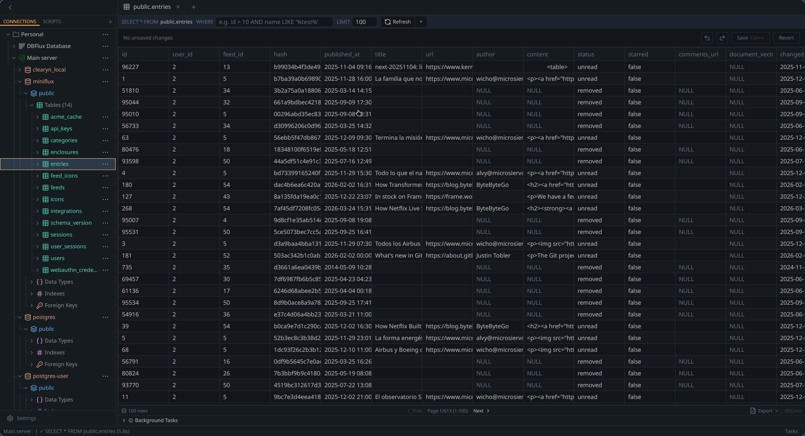

# DBFlux

A fast, keyboard-first database client built with Rust and GPUI.

## Overview

DBFlux is an open-source database client written in Rust, built with GPUI (Zed's UI framework). It focuses on performance, a clean UX, and keyboard-first workflows.

The long-term goal is to provide a fully open-source alternative to DBeaver, supporting both relational and non-relational databases.



## Documentation

- [Audit](docs/AUDIT.md)
- [AI + MCP Integration Guide](docs/MCP_AI_INTEGRATION.md)
- [Driver RPC Protocol](docs/DRIVER_RPC_PROTOCOL.md)
- [RPC Services Config](docs/RPC_SERVICES_CONFIG.md)
- [Lua Scripting](docs/LUA.md)

## Installation

### Linux

#### Tarball (recommended)

```bash
# Install to /usr/local (requires sudo)
curl -fsSL https://raw.githubusercontent.com/0xErwin1/dbflux/main/scripts/install.sh | sudo bash

# Install to ~/.local (no sudo required)
curl -fsSL https://raw.githubusercontent.com/0xErwin1/dbflux/main/scripts/install.sh | bash -s -- --prefix ~/.local
```

#### AppImage (portable)

```bash
# Download from releases (replace amd64 with arm64 for ARM)
wget https://github.com/0xErwin1/dbflux/releases/latest/download/dbflux-linux-amd64.AppImage
chmod +x dbflux-linux-amd64.AppImage
./dbflux-linux-amd64.AppImage
```

#### Arch Linux

Available in the AUR:

```bash
# Using an AUR helper
paru -S dbflux
# or
yay -S dbflux
```

#### Debian / Ubuntu

Download the `.deb` package from [Releases](https://github.com/0xErwin1/dbflux/releases):

```bash
# Replace amd64 with arm64 for ARM
wget https://github.com/0xErwin1/dbflux/releases/latest/download/dbflux-linux-amd64.deb
sudo dpkg -i dbflux-linux-amd64.deb
```

#### Fedora / RHEL / CentOS

Download the `.rpm` package from [Releases](https://github.com/0xErwin1/dbflux/releases):

```bash
# Replace amd64 with arm64 for ARM
sudo dnf install https://github.com/0xErwin1/dbflux/releases/latest/download/dbflux-linux-amd64.rpm
```

#### Nix

Using flakes:

```bash
# Run directly
nix run github:0xErwin1/dbflux

# Install to profile
nix profile install github:0xErwin1/dbflux

# Development shell
nix develop github:0xErwin1/dbflux
```

Or with the traditional approach:

```bash
nix-build
./result/bin/dbflux
```

### macOS

DBFlux for macOS is not signed with an Apple developer certificate. When opening for the first time, you'll see a warning about an "unidentified developer".

#### Installation

1. Download the DMG for your architecture from [Releases](https://github.com/0xErwin1/dbflux/releases):
   - **Intel Macs**: `dbflux-macos-amd64.dmg`
   - **Apple Silicon (M1/M2/M3/M4)**: `dbflux-macos-arm64.dmg`
2. Open the DMG and drag DBFlux to Applications
3. When you see the "unidentified developer" warning:
   - Go to **System Settings → Privacy & Security**
   - Click **Open Anyway** next to the security warning
   - Confirm you want to open the application

#### Bypass Gatekeeper from Terminal

```bash
# Remove quarantine attribute (allows opening without GUI confirmation)
xattr -cr /Applications/DBFlux.app

# Now you can open it normally
open /Applications/DBFlux.app
```

#### Requirements

- macOS 11.0 (Big Sur) or later

### Windows

#### Installer

1. Download `dbflux-windows-amd64-setup.exe` from [Releases](https://github.com/0xErwin1/dbflux/releases)
2. Run the installer and follow the wizard

#### Portable

1. Download `dbflux-windows-amd64.zip` from [Releases](https://github.com/0xErwin1/dbflux/releases)
2. Extract to any folder
3. Run `dbflux.exe`

> **Note**: The executable is not signed with a Windows code signing certificate. Windows SmartScreen may show a warning. Click "More info" → "Run anyway" to proceed.

#### Requirements

- Windows 10 or later
- x86_64 (ARM64 not yet supported)

### Build from Source

```bash
# Via install script (Linux)
curl -fsSL https://raw.githubusercontent.com/0xErwin1/dbflux/main/scripts/install.sh | bash -s -- --build

# Or manually
git clone https://github.com/0xErwin1/dbflux.git
cd dbflux
cargo build --release --features sqlite,postgres,mysql,mongodb,redis
./target/release/dbflux
```

### Uninstall (Linux)

```bash
# If installed with install.sh
curl -fsSL https://raw.githubusercontent.com/0xErwin1/dbflux/main/scripts/uninstall.sh | sudo bash

# From ~/.local
curl -fsSL https://raw.githubusercontent.com/0xErwin1/dbflux/main/scripts/uninstall.sh | bash -s -- --prefix ~/.local

# Remove user config and data too
./scripts/uninstall.sh --remove-config
```
## Features

### Database Support

- **PostgreSQL** with SSL/TLS modes (Disable, Prefer, Require)
- **MySQL** / MariaDB
- **SQLite** for local database files
- **MongoDB** with collection browsing, document CRUD, and shell query generation
- **Redis** with key browsing for all types (String, Hash, List, Set, Sorted Set, Stream)
- SSH tunnel support with key, password, and agent authentication
- Reusable SSH tunnel profiles

### User Interface

- Document-based workspace with multiple result tabs (like DBeaver/VS Code)
- Collapsible, resizable sidebar with ToggleSidebar command (Ctrl+B)
- Schema tree browser with lazy loading for large databases
- Schema-level metadata: indexes, foreign keys, constraints, custom types (PostgreSQL)
- Multi-tab SQL editor with syntax highlighting
- Virtualized data table with column resizing, horizontal scrolling, and sorting
- Table browser with WHERE filters, custom LIMIT, and pagination
- "Copy as Query" context menu to copy INSERT/UPDATE/DELETE as SQL, MongoDB shell, or Redis commands
- Query preview modal with language-specific syntax highlighting
- Command palette with fuzzy search
- Custom toast notification system with auto-dismiss
- Background task panel

### Keyboard Navigation

- Vim-style navigation (`j`/`k`/`h`/`l`) throughout the app
- Context-aware keybindings (Document, Sidebar, BackgroundTasks)
- Document focus with internal editor/results navigation
- Results toolbar: `f` to focus, `h`/`l` to navigate, `Enter` to edit/execute, `Esc` to exit
- Toggle sidebar with `Ctrl+B`
- Tab switching (MRU order) with `Ctrl+Tab` / `Ctrl+Shift+Tab`

### Query Management

- Query history with timestamps
- Saved queries with favorites
- Search across history and saved queries

### Export

- Shape-based export: CSV, JSON (pretty/compact), Text, Binary (raw/hex/base64)
- Export format determined by result type (table, JSON, text, binary)

## Development

### Prerequisites

**Ubuntu/Debian:**
```bash
sudo apt install pkg-config libssl-dev libdbus-1-dev libxkbcommon-dev
```

**Fedora:**
```bash
sudo dnf install pkg-config openssl-devel dbus-devel libxkbcommon-devel
```

**Arch:**
```bash
sudo pacman -S pkg-config openssl dbus libxkbcommon
```

**macOS:**
```bash
# Xcode Command Line Tools (required)
xcode-select --install
```

**Windows:**
```powershell
# Visual Studio Build Tools with C++ workload (required)
# Download from: https://visualstudio.microsoft.com/visual-cpp-build-tools/
```

### Building

```bash
cargo build -p dbflux --release
```

### Running

```bash
cargo run -p dbflux
```

### Commands

```bash
cargo check --workspace                    # Type checking
cargo clippy --workspace -- -D warnings    # Lint
cargo fmt --all                            # Format
cargo test --workspace                     # Tests
```

### Nix Development Shell

If you use Nix, you can enter a development shell with all dependencies:

```bash
# With flakes
nix develop

# Traditional
nix-shell
```

## License

MIT & Apache-2.0
